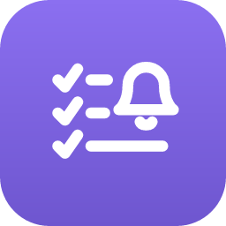

<p align="center">
  
</p>

<h1 align="center">TodoPad</h1>

<p align="center">
  <strong>The task manager that lives where you code.</strong><br/>
  Personal todos, project tasks, code comment scanning, Jira tickets, and reminders — all in your VS Code sidebar.
</p>

<p align="center">
  <a href="https://marketplace.visualstudio.com/items?itemName=gitandrun-dev.todopad">
    
  </a>
  <a href="https://marketplace.visualstudio.com/items?itemName=gitandrun-dev.todopad">
    
  </a>
  <a href="https://marketplace.visualstudio.com/items?itemName=gitandrun-dev.todopad">
    
  </a>
  <a href="https://github.com/gitandrun-dev/todopad/blob/main/LICENSE">
    
  </a>
</p>

<p align="center">
  <a href="#features">Features</a> &middot;
  <a href="#getting-started">Getting Started</a> &middot;
  <a href="#jira-integration">Jira Integration</a> &middot;
  <a href="#configuration">Configuration</a> &middot;
  <a href="#support-the-project">Support</a>
</p>

<p align="center">
  Free forever. Fueled by caffeine and <a href="https://github.com/sponsors/gitandrun-dev"><b>sponsors</b></a>.
</p>

---

## Why TodoPad?

You already live in your editor. Why should your task list live somewhere else?

TodoPad gives you a clean, fast, keyboard-friendly task manager right in the sidebar — no accounts to create, no browser tabs to juggle, no sync services to configure. It works offline, starts instantly, and stays out of your way until you need it.

Whether you're tracking personal goals across projects, managing workspace-specific tasks with your team, or keeping an eye on your Jira backlog — TodoPad handles it without ever pulling you out of flow.

---

## Features

### Dual-Scope Tasks

Two task lists, one panel. Switch between them with a single click.

- **Global scope** — Personal tasks that follow you everywhere. Syncs automatically across machines via VS Code Settings Sync.
- **Workspace scope** — Project-specific tasks stored in `.vscode/todos.json`. Keep them private or commit them so your whole team stays aligned.

### Quick Add with Priority

Type a task and hit Enter. Append `!h` for high priority or `!l` for low — no menus, no friction.

```
Fix auth redirect bug !h
Update dependencies
Clean up old migrations !l
```

### Reminders That Actually Remind You

Set a date and time on any task. When it's due, TodoPad will:

- Show a notification with **Mark Done** and **Snooze** actions
- Pulse the status bar bell so you never miss it
- Display a badge count on the sidebar icon

Snooze duration is configurable (default: 10 minutes). Reminders persist across editor restarts.

### Code TODO Scanner

TodoPad automatically finds `TODO`, `FIXME`, `HACK`, and `XXX` comments across your entire workspace. Results update in real-time as you save files.

- Click any result to jump directly to the line
- Supports 20+ languages: TypeScript, JavaScript, Python, Java, Go, Rust, C/C++, C#, Ruby, PHP, Swift, Kotlin, Scala, shell scripts, YAML, TOML, and more
- Configurable include/exclude patterns

### Jira Integration

Connect your Jira Cloud instance to see your assigned tickets right alongside your todos.

- View tickets filtered by status, project, or custom JQL
- Separate filters for Global and Workspace scopes
- Set reminders on Jira tickets (same snooze/notification system as todos)
- Click to open any ticket in your browser
- Auto-refreshes on a configurable interval
- Credentials stored securely in VS Code's secret storage

### Drag & Drop Reordering

Grab any task and drag it to reorder. Your priority, your order.

### Rich Edit Modal

Click a task to open a detail editor — update the title, add a description, change priority, or set a reminder date. All without leaving the sidebar.

### Progress Tracking

A live progress bar at the top shows your completion rate at a glance. Satisfying to watch fill up.

### Status Bar Indicator

When reminders are due, a pulsing bell appears in your status bar with a count. Click it to jump straight to TodoPad.

---

## Getting Started

1. Install from the [VS Code Marketplace](https://marketplace.visualstudio.com/items?itemName=gitandrun-dev.todopad)
2. Click the TodoPad icon in the Activity Bar
3. Start typing tasks

No accounts. No configuration. No internet required.

---

## Jira Integration

1. Open the settings gear in the TodoPad panel
2. Navigate to Integrations > Jira
3. Enter your Jira Cloud URL, email, and an [API token](https://id.atlassian.com/manage-profile/security/api-tokens)
4. Click Connect

Once connected, your assigned tickets appear below your todo list. Filter them per-scope, set reminders, and click through to Jira when you need the full context.

---

## Configuration

| Setting | Default | Description |
|---------|---------|-------------|
| `todopad.enableSync` | `true` | Sync global TODOs across machines via Settings Sync |
| `todopad.codeScan.enabled` | `true` | Scan workspace for TODO/FIXME/HACK/XXX comments |
| `todopad.codeScan.includePatterns` | `**/*.{ts,js,py,...}` | Glob pattern for files to scan |
| `todopad.codeScan.excludePatterns` | `**/node_modules/**,...` | Glob patterns to exclude from scanning |
| `todopad.snoozeDuration` | `10` | Snooze duration in minutes (1–1440) |

---

## Design Philosophy

- **Zero runtime dependencies.** Ships as a single bundled file. No `node_modules` at runtime.
- **Instant startup.** No network calls needed to show your tasks.
- **Theme-aware.** Every color adapts to your VS Code theme — light, dark, or high contrast.
- **Privacy-first.** All data stays local (or in Settings Sync, which you control). Nothing is sent to external servers.
- **Keyboard-friendly.** Quick-add from the input, Enter to submit, shortcuts for common actions.

---

## Support the Project

**TodoPad is free and always will be.** Sponsorships keep the caffeine flowing and the features shipping.

<a href="https://github.com/sponsors/gitandrun-dev">
  
</a>

**Other ways to help:**

- Star the repo on [GitHub](https://github.com/gitandrun-dev/todopad)
- Leave a review on the [Marketplace](https://marketplace.visualstudio.com/items?itemName=gitandrun-dev.todopad)
- Share it with your team
- [Report bugs or suggest features](https://github.com/gitandrun-dev/todopad/issues)

---

## Contributing

Contributions are welcome! Fork the repo, create a branch, make your changes, and open a PR.

```bash
npm install       # Install dev dependencies
npm run build     # Build the extension
npm test          # Run tests
npm run format    # Format code with Prettier
```

Press `F5` to launch the Extension Development Host for testing.

---

## License

[MIT](LICENSE) — no strings attached. But a star or a [sponsor](https://github.com/sponsors/gitandrun-dev) never hurts.
